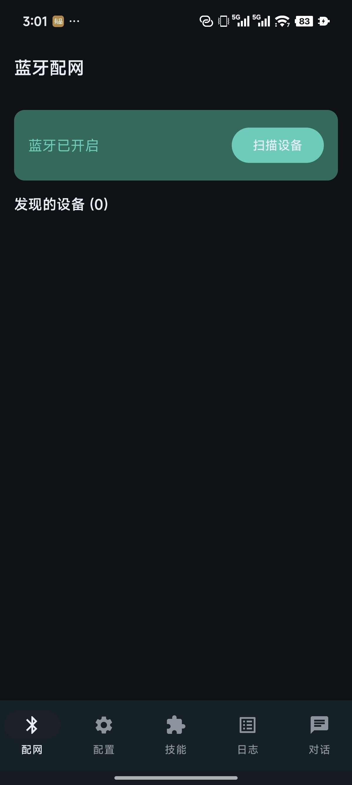
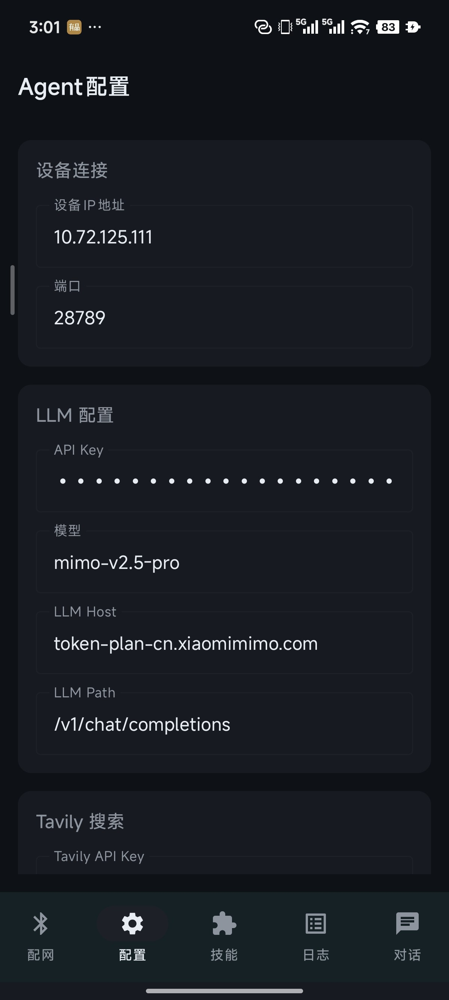
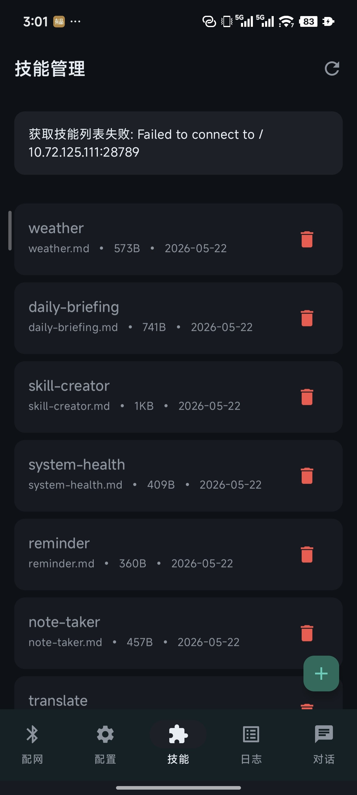
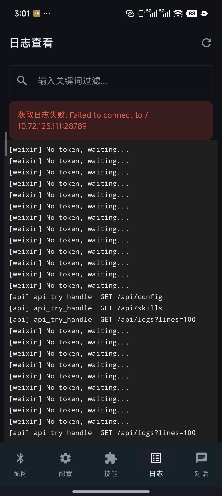
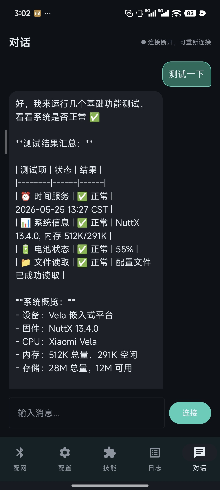

# com.agent.coapp

OpenVela AI Agent 的 Android 配套 App，用于管理、配置和对话 Agent 设备（手表/开发板）。

## 功能

- **BLE 配网** — 扫描发现 Agent 设备，蓝牙配网接入 WiFi
- **配置管理** — LLM API Key、模型、搜索/ASR/TTS 等配置的读写同步
- **技能管理** — 查看已安装技能，推送新技能到设备
- **实时对话** — WebSocket 连接 Agent 设备进行对话
- **设备日志** — 查看设备端运行日志

## 📱 Screenshots

### BLE 配网 & 配置

| 配网 | 配置 |
|:---:|:---:|
|  |  |

### 技能 & 日志 & 对话

| 技能 | 日志 | 对话 |
|:---:|:---:|:---:|
|  |  |  |

## 技术栈

- Kotlin + Jetpack Compose + Material 3
- BLE（蓝牙低功耗）扫描 + GATT 通信
- OkHttp（REST API + WebSocket）
- MVVM 架构（ViewModel + StateFlow）
- DataStore 配置持久化

## 项目结构

```
app/src/main/java/com/agent/coapp/
├── AgentApplication.kt
├── MainActivity.kt
├── ble/BleManager.kt
├── data/          # ChatMessage, ConfigData, SkillData
├── network/       # DeviceApiService, WebSocketManager
├── repository/    # ConfigRepository, DeviceRepository
├── ui/
│   ├── chat/      # 对话界面
│   ├── config/    # 配置界面
│   ├── logs/      # 日志界面
│   ├── provisioning/ # BLE 配网界面
│   ├── skills/    # 技能管理界面
│   └── theme/     # 主题配色 (Terminal Teal v2)
└── viewmodel/     # 各页面 ViewModel
```

## 编译

```bash
./gradlew assembleDebug
# 产物: app/build/outputs/apk/debug/app-debug.apk
```

环境要求：Android SDK 34+, JDK 17, minSdk 26 (Android 8.0+)

## 设备端 API

Agent 设备配网后通过 WiFi 提供 HTTP API：

| 接口 | 方法 | 说明 |
|------|------|------|
| `/api/config` | GET/POST | 读写配置 |
| `/api/skills` | GET | 获取技能列表 |
| `/api/skills/push` | POST | 推送技能 |
| `/api/logs` | GET | 获取日志 |
| `/api/chat` | WS | WebSocket 对话 |

配置项：`llm_api_key`, `llm_base_url`, `llm_model`, `search_api_key`, `asr_api_key`, `tts_api_key`

## 文档

- [开发流程](DEVELOPMENT.md) — 环境搭建、分支策略、编译调试、发版流程
- [开发笔记](DEVNOTES.md) — 需求进度、已知问题、待优化项

## License

Private
